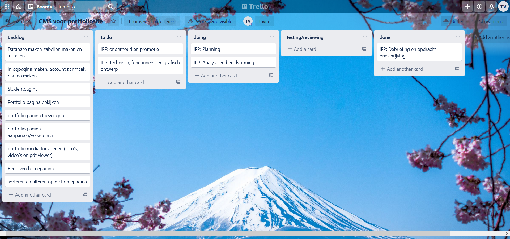

# Beeldvorming

## MoSCoW Analyse

### Must do

- Inlog pagina voor studenten
- Mail pagina voor bedrijven
- Inlog pagina voor bedrijven
- Portfolio bekijken, bewerken en verwijderen
- pdf in pagina kunnen bekijken
- Foto's en video's in de pagina kunnen kijken
- Bedrijven homepagina
- Homepagina sorteren en filteren
- Logo en fonts in de style van glr.

### Should do

- Studenten foto's op de studenten pagina's
- CV pagina met personalia, opleidingen en werkervaringen enz.

### Could do

- Extra media types toevoegen, zoals webp enz.
- Admin pagina waar de bedrijven die niet meer de website op mogen, verwijderd kunnen worden
- Meerdere Media kunnen uploaden

### Would do

- Markdown voor portfolio projecten
- CV en andere projecten naar pdf kunnen exporteren met plaatjes er bij
- Studenten kunnen zoeken

# Planning

Tijdens dit project werk ik niet met een deadline maar met een scrum techniek.
Mijn scrum board ziet er zo uit:

En een link naar trello zelf:
[Link naar trello](https://trello.com/b/o7yuWTiT)

