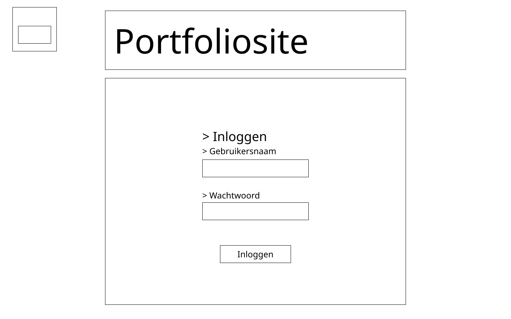
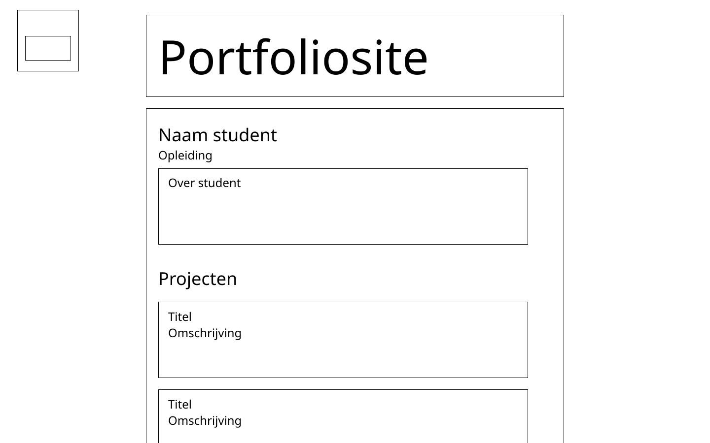
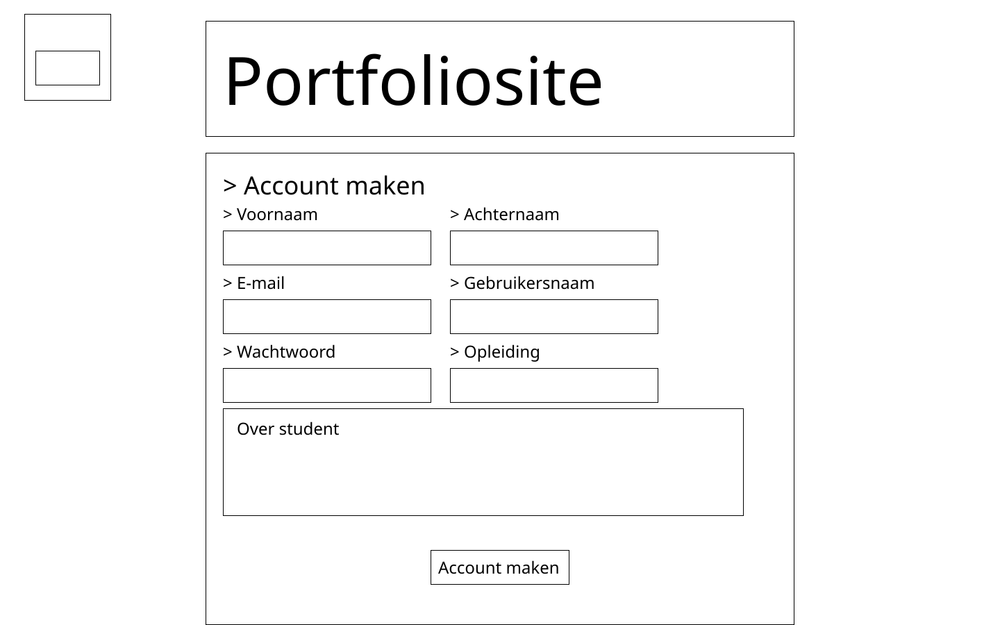
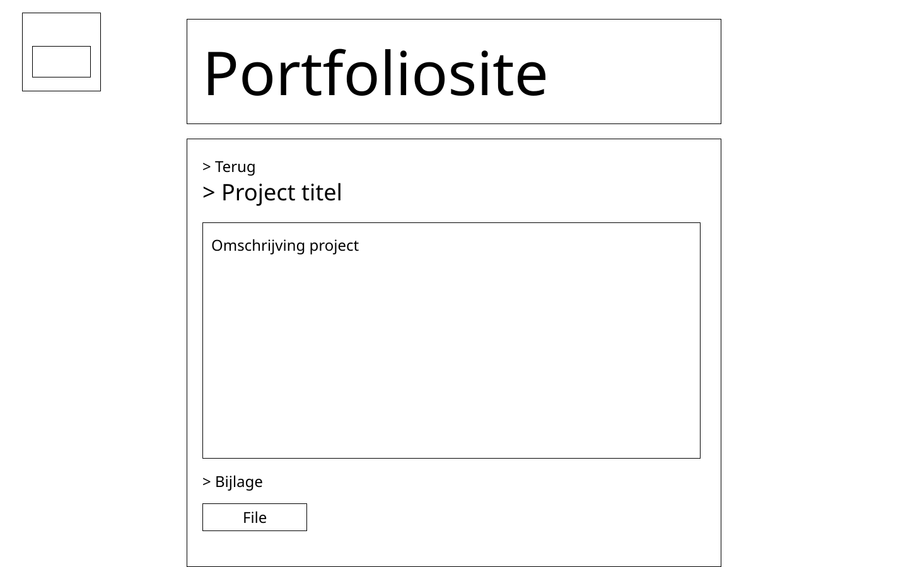
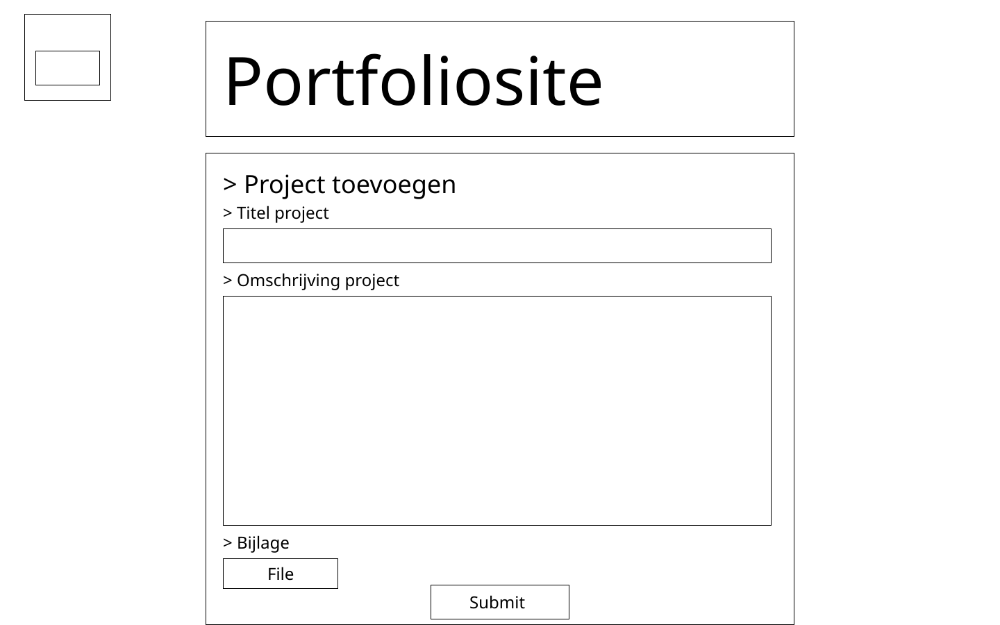
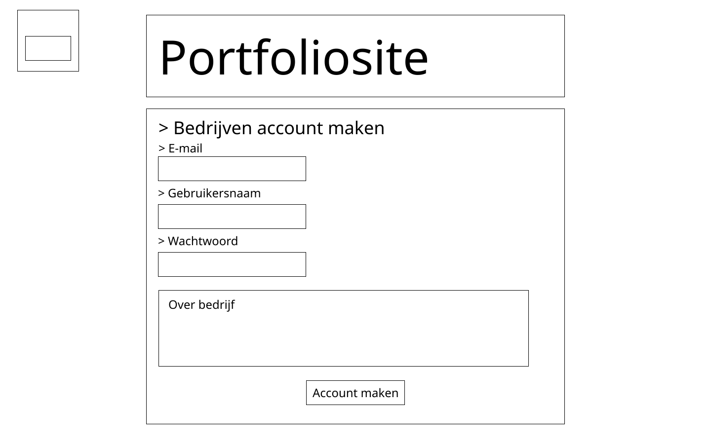
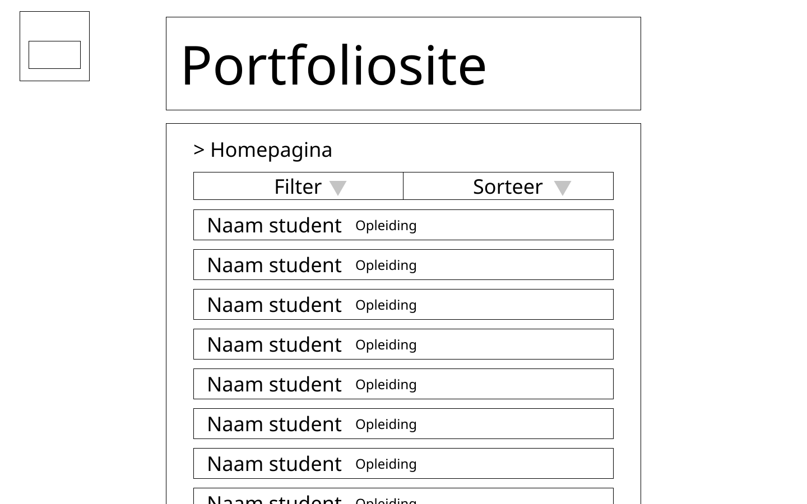

## Functioneel Ontwerp

Flowchart voor de website:

## Technisch Ontwerp

### Database ontwerp

### Technologien

- PHP 7.3

  Dit is voor alles wat met de backend te maken heeft, connectie met de database enzovoorts.

- HTML 5

  Geeft de structuur van de website.

- CSS 3

  Brengt styling aan de website

- Javascript

  Voor extra client sided dingen die ik niet in PHP kan doen.

- MySQL

  Voor de database queries

## Grafisch Ontwerp

### Wireframes

Inlogpagina

Studentenpagina

Account aanmaken voor studenten

Project bekijken

Project aanpassen, verwijderen of toevoegen.

Bedrijf account aanmaken

Homepagina

Homepagina met kleur

### Kleuren en fonts

#### Kleuren

- Zwart
- Wit
- Grijs (RGB 102/102/102)
- Groen (RGB 143/229/007) (#8fe507)

##### Opleiding kleuren

- AV Media (RGB 255/221/000)
- Redactie medewerker (RGB 231/049/136)
- Mediamanagement (RGB 245/156/000)
- Mediavormgeven (RGB 228/004/040)
- Creative productie (RGB 120/063/145)
- Mediatechnologie (RGB 000/099/175)
- Evenemententechniek (RGB 045/184/197)

#### Fonts

- Nimbus sans

