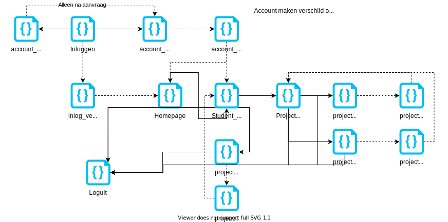
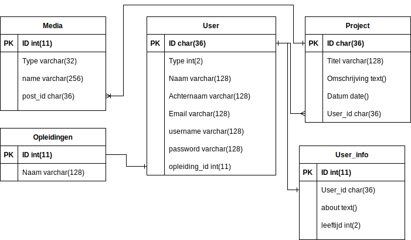

## Functioneel Ontwerp

Flowchart voor de website:

## Technisch Ontwerp

### Database ontwerp

### Technologien

- PHP 7.3

  Dit is voor alles wat met de backend te maken heeft, connectie met de database enzovoorts.

- HTML 5

  Geeft de structuur van de website.

- CSS 3

  Brengt styling aan de website

- Javascript

  Voor extra client sided dingen die ik niet in PHP kan doen.

- MySQL

  Voor de database queries

## Grafisch Ontwerp

